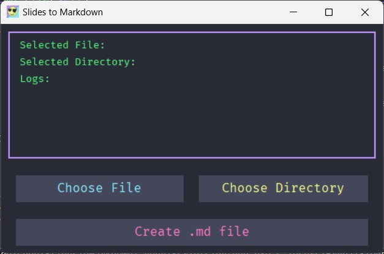

# Slides To Markdown 0.1

A simple tool that converts PDF slides into a markdown note template.


## Screenshot



## Installation

1. Download the project zip
2. Setup python virtual environment (recommended)

For example:
```bash
virtualenv .venv
source .venv/Scripts/activate
python -m pip install --upgrade pip
```
3. Install required packages
```bash
pip install -r requirements.txt
```
4. Run program
```bash
python gui.py
```